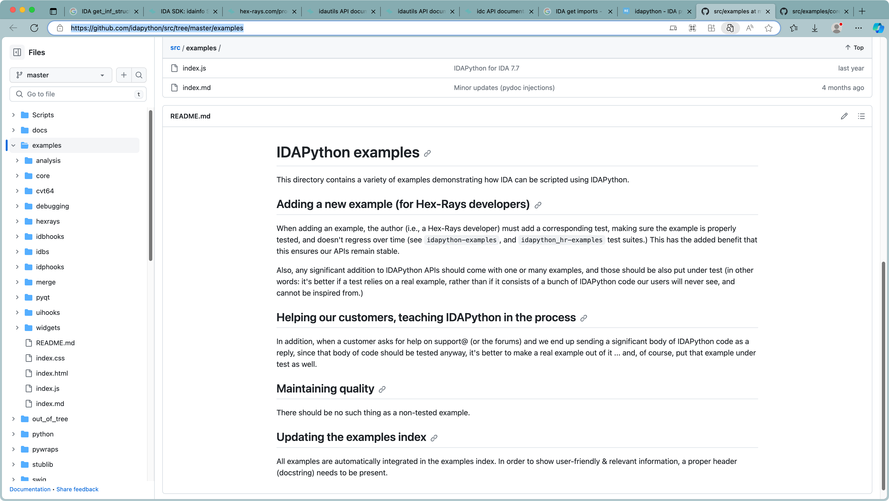
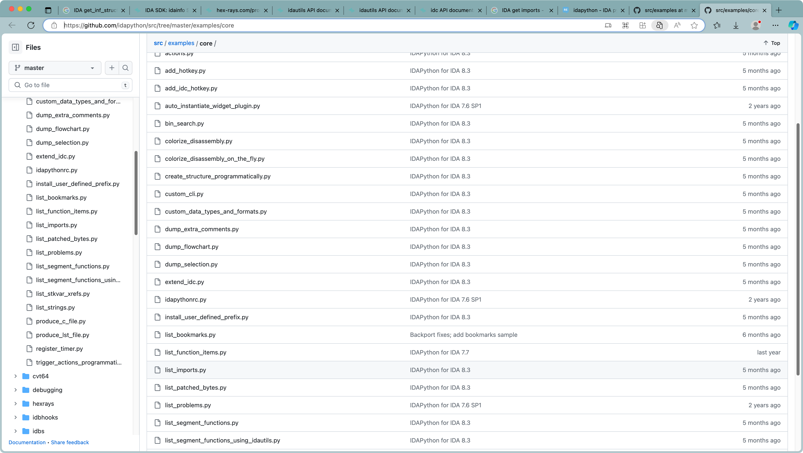

# IDA官网示例代码

* IDA官网示例代码
  * 入口
    * [src/examples at master · idapython/src (github.com)](https://github.com/idapython/src/tree/master/examples)
      * 
  * 包含
    * core核心
      * [src/examples/core at master · idapython/src (github.com)](https://github.com/idapython/src/tree/master/examples/core)
        * 图
          * 
        * 包括
          * [list_bookmarks.py](https://github.com/idapython/src/blob/master/examples/core/list_bookmarks.py)
          * [list_function_items.py](https://github.com/idapython/src/blob/master/examples/core/list_function_items.py)
          * [list_imports.py](https://github.com/idapython/src/blob/master/examples/core/list_imports.py)
          * [list_segment_functions.py](https://github.com/idapython/src/blob/master/examples/core/list_segment_functions.py)
          * [list_strings.py](https://github.com/idapython/src/blob/master/examples/core/list_strings.py)
          * 等等
