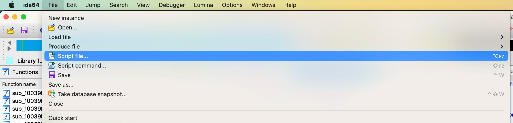
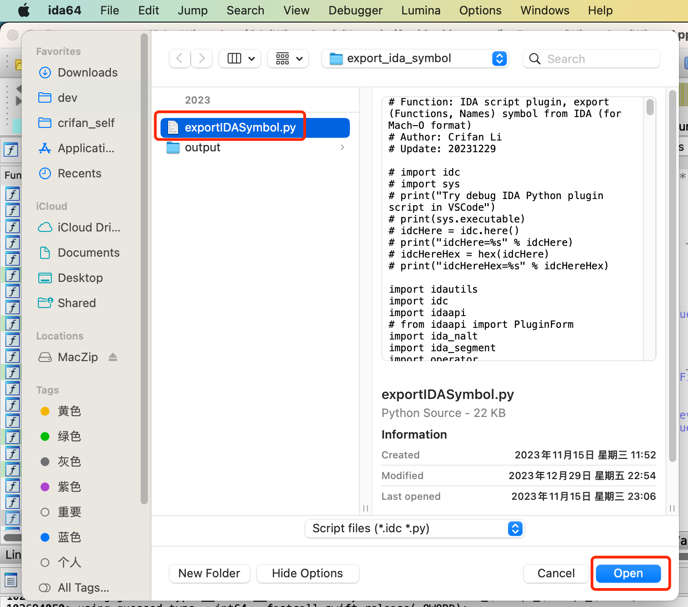
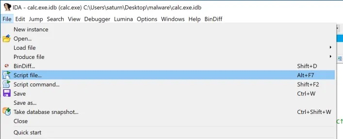
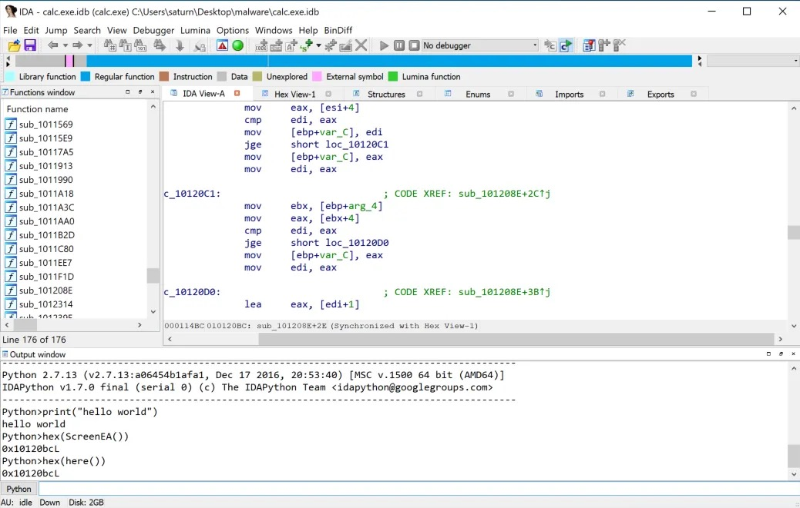
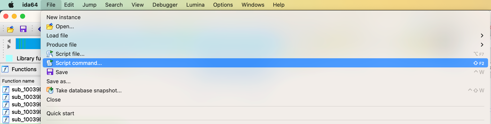
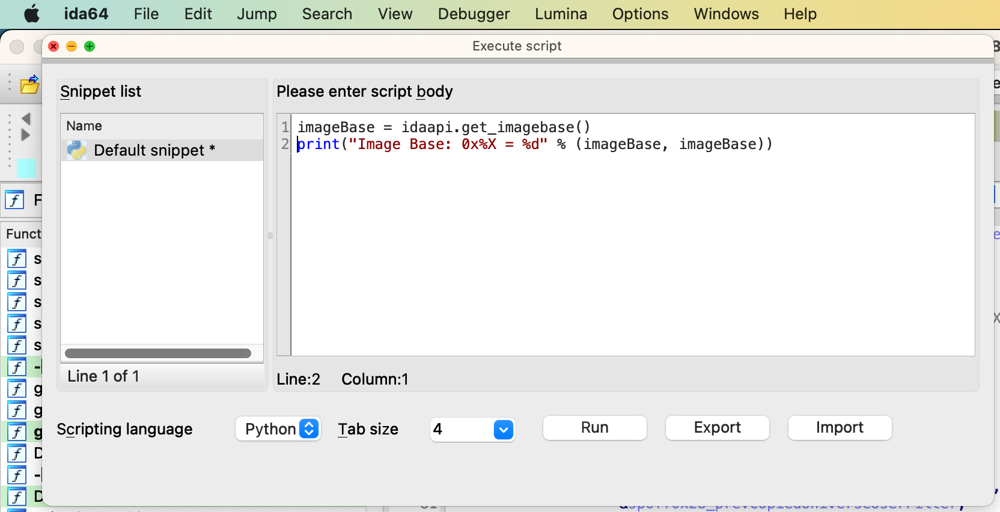

# 运行IDA脚本插件

* 运行IDA脚本插件
  * 最典型方式：加载脚本文件=`Script file`
    * 步骤
      * `IDA`->`File`->`Script file` ->选择对应IDA的Python脚本文件-》即可运行
    * 图
      * Mac
        * 
        * 
      * Win
        * 
  * 其他方式
    * `IDAPython Interpreter`=`IDAPython交互式命令行解析器`
      * 主要用途：临时写点Python脚本代码测试
      * 界面
        * 
    * `Script Command`
      * 步骤
        * `IDA`->`File`->`Script Command` ->自己输入要运行的Python脚本
      * 图
        * Mac
          * 
          * 
